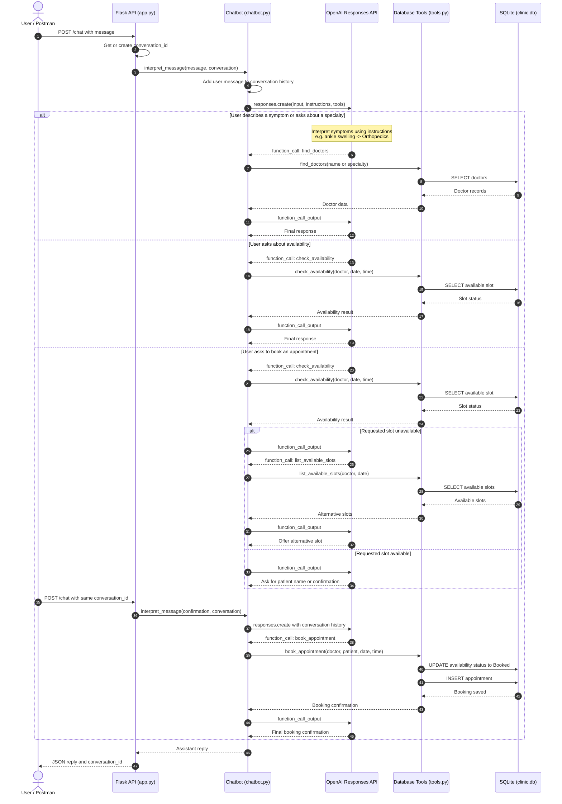

# Doctor's Assistant Sequence Diagram

This diagram shows how a user request travels through the Flask API, OpenAI Responses API, database tools, and SQLite database.

## Main Components

- **User / Postman** sends messages to the `/chat` endpoint.
- **Flask API** manages requests and conversation IDs.
- **Chatbot** runs the Responses API tool-calling loop.
- **OpenAI Responses API** decides whether a database tool is needed.
- **Database tools** execute doctor, availability, and booking operations.
- **SQLite** stores doctors, availability slots, and appointments.
